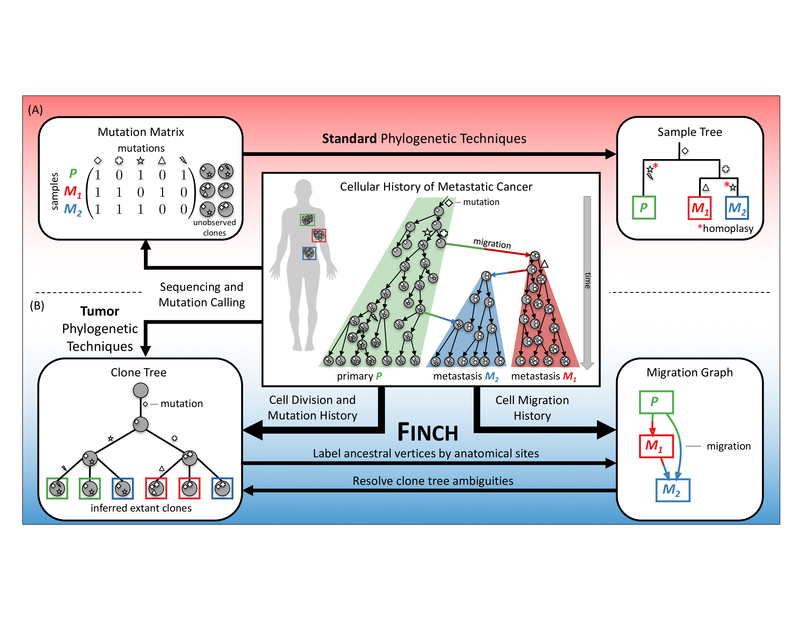

# MACHINA - Metastatic And Clonal History INtegrative Analysis

MACHINA is a computational framework for inferring migration patterns between a primary tumor and metastases using DNA sequencing data.


## Contents

  1. [Compilation instructions](#compilation)
     * [Dependencies](#dep)
     * [Compilation](#comp)
  2. [Usage instructions](#usage)
     * [I/O formats](#io)
       - [Clone tree](#clonetree)
       - [Leaf labeling](#leaflabeling)
       - [Vertex labeling](#vertexlabeling)
       - [Mutation tree](#mutationtree)
       - [Frequencies](#frequencies)
     * [Parsimonious Migration History](#pmh)
     * [Parsimonious Migration History with Polytomy Resolution](#pmh_pr)
     * [Parsimonious Migration History and Clone Tree Inference](#pmh_cti)

<a name="compilation"></a>
## Compilation instructions

<a name="dep"></a>
### Dependencies

MACHINA is written in C++11 and thus requires a modern C++ compiler (GCC >= 4.8.1, or Clang). In addition, MACHINA has the following dependencies.

* [CMake](http://www.cmake.org/) (>= 2.8)
* [Boost](http://www.boost.org) (>= 1.38)
* [LEMON](http://lemon.cs.elte.hu/trac/lemon) graph library (>= 1.3)
* [Gurobi](http://www.gurobi.com) (>= 6.0)

[Graphviz](http://www.graphviz.org) is required to visualize the resulting DOT files, but is not required for compilation.

In case [doxygen](http://www.stack.nl/~dimitri/doxygen/) is available, extended source code documentation will be generated.

<a name="comp"></a>
### Compilation

To compile SPRUCE, execute the following commands from the root of the repository:

    $ mkdir build
    $ cd build
    $ cmake ..
    $ make

In case CMake fails to detect LEMON, run the following command with adjusted paths:

    $ cmake -DLIBLEMON_ROOT=~/lemon \
    -DGUROBI_INCLUDE_DIR=/usr/local/gurobi702/linux64/include \
    -DGUROBI_CPP_LIB=/usr/local/gurobi702/linux64/lib/libgurobi_c++.a \
    -DGUROBI_LIB=/usr/local/lib/libguroibi70.so ..

The compilation results in the following files in the `build` directory:

EXECUTABLE | DESCRIPTION
-----------|-------------
`pmh_sankoff`  | Enumerates all minimum-migration vertex labelings given a clone tree.
`pmh` | Solves the Parsimonious Migration History (PMH) problem under various topological constraints (PS, S, M or R) given a clone tree.
`pmh_pr`    | Solves the Parsimonious Migration History with Polytomy Resolution (PMH-PR) problem under various topological constraints given a clone tree.
`pmh_cti`     | Solves the Parsimonious Migration History and Clone Tree Inference (PMH-CTI) under various topological constraints.
`generatemigrationtrees` | Generates all migration trees given anatomical site labels. These migration trees can be used to constraint the search space of the `pmh`, `pmh_pr` and `pmh_cti` algorithms.
`visualizeclonetree` | Visualizes a clone tree and optional vertex labeling.
`visualizemigrationgraph` | Visualizes the migration graph given a clone tree and vertex labeling.

<a name="usage"></a>
## Usage instructions

<a name="io"></a>
### I/O formats

Below we describe the various formats used by the algorithms of the `MACHINA` framework.

<a name="clonetree"></a>
#### Clone tree

A clone tree is provided as an edge list. Each line specifies an edge by listing the labels of the incident vertices separated by a space or tab character. For example:

    A A1
    A A2
    A A3
    A A4
    A A5
    A A6
    ...

See [patient1.tree](data/mcpherson_2016/patient1.tree) for the complete clone tree.

<a name="leaflabeling"></a>
#### Leaf labeling

A leaf labeling assigns an anatomical site label to each leaf of a clone tree. Each line contains two values, the leaf label and the anatomical site label separated by a space or tab character. For example:

    A1 Om
    A2 SBwl
    A3 LFTB
    A4 LOv
    A5 ApC
    A6 RFTA
    ...

See [patient1.labeling](data/mcpherson_2016/patient1.labeling) for the complete leaf labeling.

<a name="vertexlabeling"></a>
#### Vertex labeling

A vertex labeling assigns an anatomical site label to each vertex of a clone tree (including the leaves). Each line contains two values, the vertex label and the anatomical site label separated by a space or tab character. For example:

    A ROv
    B SBwl
    D ROv
    F ROv
    H ROv
    A1 Om
    A2 SBwl
    ...

See [patient1.reported.labeling](data/mcpherson_2016/patient1.reported.labeling) for the complete vertex labeling.

<a name="mutationtree"></a>
#### Mutation tree

A mutation tree is formatted in the same way as a clone tree. Each line encodes an edge by listing the vertex labels of the incident vertices separated by a space or tab character. For example:

    (cluster_1,(1,1,1)) (cluster_2,(1,1,1))
    (cluster_1,(1,1,1)) (cluster_4,(1,1,1))
    (cluster_2,(1,1,1)) (cluster_5,(1,1,1))
    (cluster_2,(1,1,1)) (cluster_6,(1,1,1))
    ...

See [sol0.tree](data/hoadley_2016/A7/sol0.tree) for the complete mutation tree.

<a name="frequencies"></a>
#### Frequencies

A frequency file encodes the frequency of every mutation (cluster) in an anatomical site (sample). It is a tab separated file. The first line lists the number of anatomical sites followed by the number of mutations on a separate line. The third line is ignored but describes the format of the rest of the file. Each subsequent line encodes the cell frequency of a mutation in an anatomical site: first the anatomical site 0-based index is given, followed by the label of the site, the 0-based index of the mutation, the label of the mutation, the frequency lower bound and upper bound.

    6 #m
    10 #n
    #sample_index	sample_label	character_index	character_label	vaf_lb	vaf_ub
    0	breast	0	(cluster_1,(1,1,1))	0.251814261011	0.272618747476
    0	breast	1	(cluster_2,(1,1,1))	0.0	0.00606896994454
    ...

See [F.tsv](data/hoadley_2016/A7/F.tsv) for the complete frequency file.

<a name="pmh"></a>
### Parsimonious Migration History (`pmh_sankoff` and `pmh`)

In the parsimonious migration history we are given a clone tree `T` whose leaves are labeled by anatomical sites. The task is to label the inner vertices of `T` such that the resulting migration graph `G` has minimum number of migrations and comigrations. It is possible to specify constraints on the topology of the migration graph.

PATTERN | DESCRIPTION
--------|------------
PS (parallel single-source seeding) | Each metastatic site is seeded directly from the primary tumor, i.e. `G` is a multi-tree such that the primary `P` is the only vertex with out-degree greater than 1.
S (single-source seeding) | Each metastatic site is seeded from only one other anatomical site, i.e. `G` is a multi-tree.
M (multi-source seeding) | A metastatic site may be seeded from multiple anatomical sites, but no directed cycles are introduced. That is, `G` is multi-DAG.
R (reseeding) | Directed cycles in `G` are allowed.

In our algorithms we allow for the following restrictions on the migration pattern:

1. Unrestricted: PS, S, M and R
2. No reseeding: PS, S, M
3. No reseeding and no multi-source seeding: PS and S
4. No reseeding, no multi-source seeding and no single-source seeding: PS

The unconstrained PMH problem can be solved by running `pmh_sankoff`, which is an adaptation of the Sankoff algorithm and enumerates all migration histories:

    Usage:
      ./pmh_sankoff [--help|-h|-help] [-c str] [-o str] [-p str] T leaf_labeling
    Where:
      T
         Clone tree
      leaf_labeling
         Leaf labeling
      --help|-h|-help
         Print a short help message
      -c str
         Color map file
      -o str
         Output prefix
      -p str
         Primary samples separated by commas (if omitted, every sample will be
         considered iteratively as the primary)

An example execution of the `pmh_sankoff` algorithm:

    $ mkdir patient1
    $ ./pmh_sankoff -p LOv,ROv -c ../data/mcpherson_2016/coloring.txt \
    ../data/mcpherson_2016/patient1.tree \
    ../data/mcpherson_2016/patient1.labeling \
    -o patient1/ 2> patient1/result.txt
    
    $ cat patient1/result.txt
    Clone tree has 7 samples
    Found 4 maximum parsimony labelings with primary 'LOv'
    Found 2 labelings with 7 comigrations, 2 seeding sites and R
    Found 2 labelings with 11 comigrations, 3 seeding sites and R
    Labeling 0: 13 migrations, 11 comigrations, 3 seeding sites and R
    Labeling 1: 13 migrations, 11 comigrations, 3 seeding sites and R
    Labeling 2: 13 migrations, 7 comigrations, 2 seeding sites and R
    Labeling 3: 13 migrations, 7 comigrations, 2 seeding sites and R
    Found 1 maximum parsimony labelings with primary 'ROv'
    Found 1 labelings with 10 comigrations, 2 seeding sites and M
    Labeling 0: 13 migrations, 10 comigrations, 2 seeding sites and M

The above command considers the left ovary (LOv) and right ovary (ROv) as the primary tumor site and enumerates all minimum migration vertex labelings of the given clone tree and leaf labeling. The output is stored in the directory patient1. In the DOT files the given color map is used for coloring the anatomical sites.

To constrain the migration graph, we can use `pmh`:

```
Usage:
  ./pmh [--help|-h|-help] [-UB num] [-c str] [-e] [-g] [-l int] [-log]
     [-m int] [-o str] [-p str] [-s str] [-t int] T leaf_labeling
Where:
  T
     Clone tree
  leaf_labeling
     Leaf labeling
  --help|-h|-help
     Print a short help message
  -UB num
     Upper bound (default: -1, disabled)
  -c str
     Color map file
  -e
     Export ILP
  -g
     Output search graph
  -l int
     Time limit in seconds (default: -1, no time limit)
  -log
     Gurobi logging
  -m int
     Allowed migration patterns:
       0 : PS
       1 : PS, S
       2 : PS, S, M
       3 : PS, S, M, R
     If no pattern is specified, all allowed patterns will be enumerated.
  -o str
     Output prefix
  -p str
     Primary samples separated by commas (if omitted, every sample will be
     considered iteratively as the primary)
  -s str
     Fix comigrations according to provided migration graph
  -t int
     Number of threads (default: -1, #cores)
```

An example execution of the `pmh` algorithm:

    $ mkdir patient1_constrained
    $ ./pmh -p LOv,ROv -c ../data/mcpherson_2016/coloring.txt \
    ../data/mcpherson_2016/patient1.tree \
    ../data/mcpherson_2016/patient1.labeling \
    -o patient1_constrained/ 2> patient1_constrained/result.txt
    
    $ cat patient1_constrained/result.txt
    Clone tree has 7 samples
    With primary 'LOv', allowed patterns: (PS) and no binarization: 15 migrations, 6 comigrations and 1 seeding sites. [LB, UB] = [15.2552, 15.2552]. 0.00908494 seconds
    With primary 'ROv', allowed patterns: (PS) and no binarization: 14 migrations, 6 comigrations and 1 seeding sites. [LB, UB] = [14.2552, 14.2552]. 0.00143409 seconds
    With primary 'LOv', allowed patterns: (PS, S) and no binarization: 15 migrations, 6 comigrations and 1 seeding sites. [LB, UB] = [15.2552, 15.2552]. 0.00133801 seconds
    With primary 'ROv', allowed patterns: (PS, S) and no binarization: 14 migrations, 6 comigrations and 1 seeding sites. [LB, UB] = [14.2552, 14.2552]. 0.00125289 seconds
    With primary 'LOv', allowed patterns: (PS, S, M) and no binarization: 15 migrations, 6 comigrations and 1 seeding sites. [LB, UB] = [15.2552, 15.2552]. 0.00285292 seconds
    With primary 'ROv', allowed patterns: (PS, S, M) and no binarization: 13 migrations, 10 comigrations and 2 seeding sites. [LB, UB] = [13.4271, 13.4271]. 0.00408292 seconds
    With primary 'LOv', allowed patterns: (PS, S, M, R) and no binarization: 13 migrations, 7 comigrations and 2 seeding sites including reseeding. [LB, UB] = [13.3021, 13.3021]. 0.00917792 seconds
    With primary 'ROv', allowed patterns: (PS, S, M, R) and no binarization: 13 migrations, 10 comigrations and 2 seeding sites. [LB, UB] = [13.4271, 13.4271]. 0.00402594 seconds

<a name="pmh_pr"></a>
### Parsimonious Migration History with Polytomy Resolution (`pmh_pr`)

In the parsimonious migration history with polytomy resolution we are given a clone tree `T` whose leaves are labeled by anatomical sites. The task is to find a binarization `T'` of `T` and label its inner vertices of such that the resulting migration graph `G` has minimum number of migrations and comigrations. It is possible to specify constraints on the topology of the migration graph.

```
Usage:
  ./pmh_pr [--help|-h|-help] [-UB num] [-c str] [-e] [-g] [-l int] [-log]
     [-m int] [-o str] [-p str] [-s str] [-t int] T leaf_labeling
Where:
  T
     Clone tree
  leaf_labeling
     Leaf labeling
  --help|-h|-help
     Print a short help message
  -UB num
     Upper bound (default: -1, disabled)
  -c str
     Color map file
  -e
     Export ILP
  -g
     Output search graph
  -l int
     Time limit in seconds (default: -1, no time limit)
  -log
     Gurobi logging
  -m int
     Allowed migration patterns:
       0 : PS
       1 : PS, S
       2 : PS, S, M
       3 : PS, S, M, R
     If no pattern is specified, all allowed patterns will be enumerated.
  -o str
     Output prefix
  -p str
     Primary samples separated by commas (if omitted, every sample will be
     considered iteratively as the primary)
  -s str
     Fix comigrations according to provided migration graph
  -t int
     Number of threads (default: -1, #cores)
```

An example execution:

```
$ mkdir patient1_pr
$ ./pmh_pr -p LOv,ROv -c ../data/mcpherson_2016/coloring.txt \
../data/mcpherson_2016/patient1.tree \
../data/mcpherson_2016/patient1.labeling \
-o patient1_pr/ 2> patient1_pr/result.txt

$ cat patient1_pr/result.txt
Clone tree has 7 samples
With primary 'LOv', allowed patterns: (PS) and binarization: 12 migrations, 6 comigrations and 1 seeding sites. [LB, UB] = [12.0506, 12.0506]. 0.0693879 seconds
With primary 'ROv', allowed patterns: (PS) and binarization: 13 migrations, 6 comigrations and 1 seeding sites. [LB, UB] = [13.0506, 13.0506]. 0.0793171 seconds
With primary 'LOv', allowed patterns: (PS, S) and binarization: 12 migrations, 6 comigrations and 1 seeding sites. [LB, UB] = [8.80139, 12.0506]. 10.0016 seconds
With primary 'ROv', allowed patterns: (PS, S) and binarization: 12 migrations, 6 comigrations and 2 seeding sites. [LB, UB] = [8.2178, 12.0517]. 10.0042 seconds
With primary 'LOv', allowed patterns: (PS, S, M) and binarization: 12 migrations, 6 comigrations and 1 seeding sites. [LB, UB] = [8.75506, 12.0506]. 10.0034 seconds
With primary 'ROv', allowed patterns: (PS, S, M) and binarization: 12 migrations, 7 comigrations and 3 seeding sites. [LB, UB] = [6.05165, 12.061]. 10.0079 seconds
With primary 'LOv', allowed patterns: (PS, S, M, R) and binarization: 11 migrations, 8 comigrations and 3 seeding sites including reseeding. [LB, UB] = [6.05158, 11.0692]. 10.0039 seconds
With primary 'ROv', allowed patterns: (PS, S, M, R) and binarization: 12 migrations, 7 comigrations and 2 seeding sites. [LB, UB] = [6.05084, 12.0599]. 10.0033 seconds
```

<a name="pmh_cti"></a>
### Parsimonious Migration History and Clone Tree Inference (`pmh_cti`)

Given a mutation tree `T` with mutation frequencies `F-` and `F+`, the task is to find a frequency assignment `F` yielding binarized clone tree `T'` that admits a vertex labeling `l` such that the resulting migration graph `G` has minimum number of migrations and comigrations. It is possible to specify constraints on the topology of the migration graph.

```
Usage:
  ./pmh_cti [--help|-h|-help] [-UB num] -c str [-e] [-g] [-l int] [-log]
     [-m int] [-o str] [-p str] [-s str] [-t int] T frequencies
Where:
  T
     Mutation tree
  frequencies
     Frequencies
  --help|-h|-help
     Print a short help message
  -UB num
     Upper bound (default: -1, disabled)
  -c str
     Color map file
  -e
     Export ILP
  -g
     Output search graph
  -l int
     Time limit in seconds (default: -1)
  -log
     Gurobi logging
  -m int
     Allowed migration patterns:
       0 : PS
       1 : PS, S
       2 : PS, S, M
       3 : PS, S, M, R
     If no pattern is specified, all allowed patterns will be enumerated.
  -o str
     Output prefix
  -p str
     Primary samples separated by commas (if omitted, every sample will be
     considered iteratively as the primary)
  -s str
     Fix comigrations according to provided migration graph
  -t int
     Number of threads (default: -1, #cores)
```

An example execution:

```
$ mkdir migrationtrees_A7
$ cd migrationtrees_A7
$ ../generatemigrationtrees breast brain kidney liver lung rib
$ cd ..
$ mkdir A7
$ ./pmh_cti -p breast -c ../data/hoadley_2016/coloring.txt \ 
-m 1 -s migrationtrees_A7/1045.txt -o A7 \
../data/hoadley_2016/A7/sol1.tree ../data/hoadley_2016/A7/F.tsv \
2> A7/result.txt

$ cat A7/result.txt
With primary 'breast', allowed patterns: (PS, S) and binarization: 5 migrations, 5 comigrations and 2 seeding sites. [LB, UB] = [5.0242, 5.0242]. 1.19276 seconds (A7)
```
